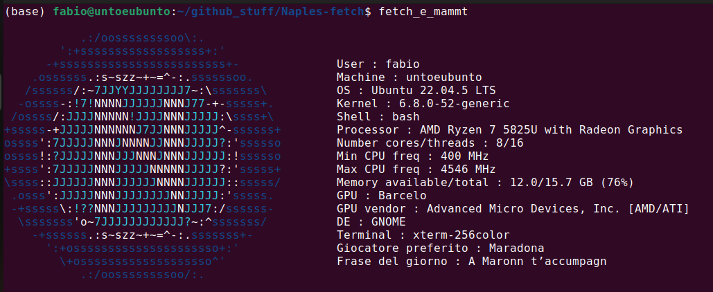

# Naples fetch

Programma simile a "neofetch" che mostra il logo del Napoli.

> **DISCLAIMER**: Questo programmino è fatto per essere usato su **Ubuntu con GNOME come Desktop Environment**. Qualora venisse usato su altre distro e/o su altri DE/WM, alcuni campi **potrebbero non funzionare** a dovere (soprattutto quelli legati al tipo di terminale e al DE).

## Dipendenze

Per eseguire correttamente il programma, occorre prima installare le dipendenze, ossia `lscpu` (comando utile per vedere le specifiche della CPU) e `lshw` (comando utile per vedere le specifiche di hardware e periferiche).  
Per farlo, basta eseguire nel terminale il comando:

```bash
sudo apt install lscpu lshw
```

## Esecuzione

Una volta installate le dipendenze, per lanciare il programma basta eseguire in questa cartella i seguenti comandi:

```bash
chmod +x fetch_e_mammt
./fetch_e_mammt
```


